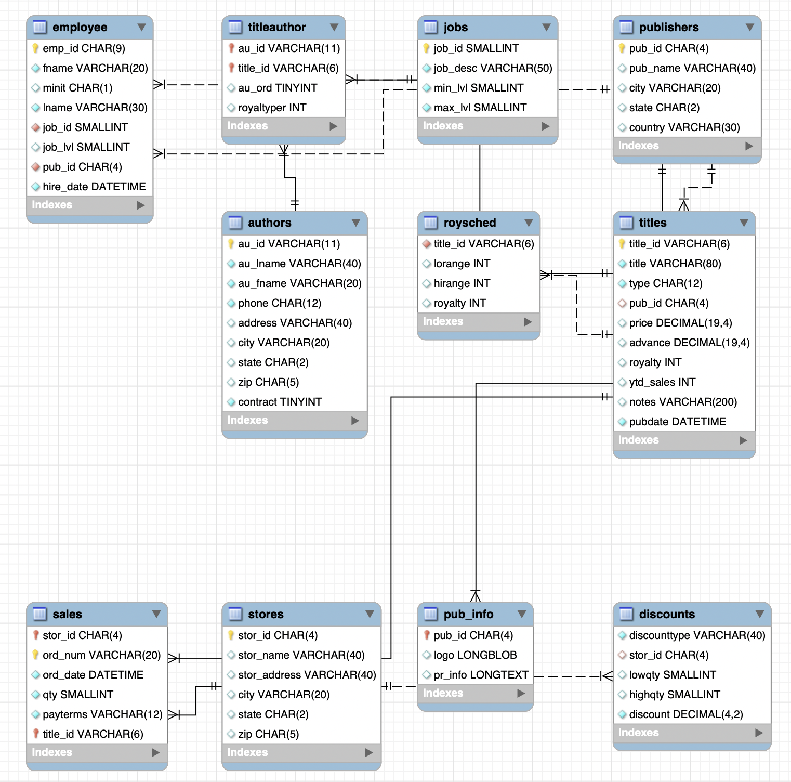

# Lab | MySQL Select

## Introducción

En este laboratorio practicarás cómo usar la sentencia `SELECT` de MySQL, que será extremadamente útil en tu futuro trabajo como analista/científico/ingeniero de datos. **Usarás la base de datos `publications`**. Puedes encontrarla en la base de datos de Ironhack. Utiliza tu aplicación de gestión de bases de datos para consultar `publications`.

Crearás un archivo `solutions.sql` en el directorio `your-code` para registrar tus soluciones a todos los desafíos.

Puedes explorar tu base de datos y tabla por tu cuenta, pero aquí tienes una vista rápida de cómo está modelada la DB:

## Desafío 1 - ¿Quién ha publicado qué y dónde?

En este desafío escribirás una consulta `SELECT` de MySQL que una varias tablas para descubrir qué títulos ha publicado cada autor en qué editoriales. Tu salida debe tener al menos las siguientes columnas:

- `AUTHOR ID` - el ID del autor
- `LAST NAME` - apellido del autor
- `FIRST NAME` - nombre del autor
- `TITLE` - nombre del título publicado
- `PUBLISHER` - nombre de la editorial donde se publicó el título

Tu salida se verá algo así:

_Nota: la captura de pantalla anterior no es la salida completa._

Si tu consulta es correcta, el total de filas en tu salida debería ser el mismo que el total de registros en la Tabla `titleauthor`.

## Desafío 2 - ¿Quién ha publicado cuántos y dónde?

Partiendo de tu solución en el Desafío 1, consulta cuántos títulos ha publicado cada autor en cada editorial. Tu salida debería parecerse a esto:

_Nota: la captura de pantalla anterior no es la salida completa._

Para verificar si tu salida es correcta, suma la columna `TITLE COUNT`. El número sumado debería ser el mismo que el total de registros en la Tabla `titleauthor`.

_Sugerencia: Para contar el número de títulos publicados por un autor, necesitas usar [MySQL COUNT](https://dev.mysql.com/doc/refman/8.0/en/counting-rows.html). También consulta [MySQL Group By](https://dev.mysql.com/doc/refman/8.0/en/group-by-modifiers.html) porque contarás las filas de diferentes grupos de datos. Consulta las referencias y aprende por ti mismo. Estas características se discutirán formalmente en la lección de Tablas Temporales y Subconsultas._

## Desafío 3 - Autores Más Vendidos

¿Quiénes son los 3 principales autores que han vendido el mayor número de títulos? Escribe una consulta para averiguarlo.

Requisitos:

- Tu salida debería tener las siguientes columnas:
  - `AUTHOR ID` - el ID del autor
  - `LAST NAME` - apellido del autor
  - `FIRST NAME` - nombre del autor
  - `TOTAL` - número total de títulos vendidos de este autor
- Tu salida debería estar ordenada basándose en `TOTAL` de mayor a menor.
- Solo muestra los 3 mejores autores en ventas.

## Desafío 4 - Ranking de Autores Más Vendidos

Ahora modifica tu solución en el Desafío 3 para que la salida muestre a todos los 23 autores en lugar de solo los 3 principales. Ten en cuenta que los autores que han vendido 0 títulos también deben aparecer en tu salida (idealmente muestra `0` en lugar de `NULL` como `TOTAL`). También ordena tus resultados basándose en `TOTAL` de mayor a menor.

## Entregables

- `solution.sql` que contiene todas tus consultas MySQL.

## Entrega

- Añade `solutions.sql` a git.
- Haz commit de tu código.
- Empuja a tu fork.
- Crea una solicitud de extracción al repositorio de la clase.

## Referencias

- [MySQL Reference: Counting Rows](https://dev.mysql.com/doc/refman/8.0/en/counting-rows.html)
- [MySQL Reference: Group By](https://dev.mysql.com/doc/refman/8.0/en/group-by-modifiers.html)
- [MySQL Reference: SUM Function](https://dev.mysql.com/doc/refman/8.0/en/group-by-functions.html#function_sum)
